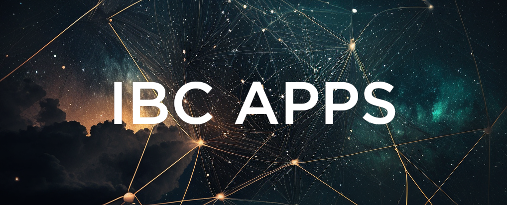

# ibc-apps

IBC applications and middleware for Cosmos SDK blockchains

🌌 Why have an IBC-Apps repo?
=============================

Once upon a time there was [IBC-Go](https://github.com/cosmos/ibc-go). And it grew and it grew until finally, propagating updates and changes outside the core functionality was becoming cumbersome.

This [ibc-apps](https://github.com/cosmos/ibc-apps) repo is meant to be an easily discoverable, navigable, central place for modules and middleware.

🌌🌌 Who's it for?
=============================

IBC-Apps is for:
- _Core IBC-Go contributors_; it frees them from having to maintain IBC Apps,
- _Publishers of IBC Apps_, so their apps can be easily found by
- _Everyone who uses IBC_ and wants to benefit from the full range of its capabilities.

🌌🌌🌌 What is it?
=============================

### What is IBC?

The Inter-Blockchain Communication Protocol (IBC) is a protocol to handle the authentication and transport of data between two blockchains. IBC requires a minimal set of functions, specified in the [Interchain Standards](https://github.com/cosmos/ibc/tree/main/spec/ics-001-ics-standard) (ICS). These specifications do not limit the network topology or consensus algorithm, so IBC can be used with a wide range of blockchains or state machines. The IBC protocol provides a permissionless way for relaying data packets between blockchains, unlike most trusted bridging technologies. The security of IBC reduces to the security of the participating chains.

IBC solves a widespread problem: cross-chain communication. This problem exists on public blockchains when exchanges wish to perform swaps. The problem arises early in the case of application-specific blockchains, where every asset is likely to emerge from its own purpose-built chain. Cross-chain communication is also a challenge in the world of private blockchains, in cases where communication with a public chain or other private chains is desirable.

Cross-chain communication between application-specific blockchains in Cosmos creates the potential for high horizontal scalability with transaction finality. These design features provide convincing solutions to well-known problems that plague other platforms, such as transaction costs, network capacity, and transaction confirmation finality.

### What is an IBC App?

IBC apps can be split into two categories - modules and middleware.

IBC Modules are self-contained applications that enable packets to be sent to and received from other IBC-enabled chains.  IBC application developers do not need to concern themselves with the low-level details of clients, connections, and proof verification.

IBC Middleware are self-contained modules that sit between core IBC and an underlying IBC application.  This allows developers to customize lower-level packet handling.  Multiple middleware modules can be chained together.  

🌌🌌🌌🌌 How to Use this repo
=============================

If you'd like to include software in this repo, please [submit a PR](https://github.com/cosmos/ibc-apps).

If you'd like to become a maintainer of this repo, WHO SHOULD THEY CONTACT?

🌌🌌🌌🌌🌌 Bonus Content
=============================

## Hello World

An [example IBC app](../examples/hello-world/)

## Contributing

### Some general principles

- A release and tag for _App A_ ought not be blocked on changes in other unrelated or upstream apps
- Version management must be able to be handled independently. i.e. An _App A_ can upgrade to `ibc-go v8` and release a tag against it, while _App B_ may remain unsupported for `v8`.
- Teams with general write access to the repo should not be authorized to write to apps that they do not maintain (only default branch/tags/etc). Of course, PRs welcome :-)

## List of Apps

| Name | Type | Example | Stakeholders | Description |
| ---- | ---- | ------- | ------------ | ----------- |  
| [Async Interchain Query](../modules/async-icq/) | Module | Link | [Strangelove](https://github.com/strangelove-ventures/) | Interchain Queries enable blockchains to query the state of an account on another chain without the need for ICA auth. |
| [Packet Forward Middleware](../middleware/packet-forward-middleware) | Middleware | Link | [Strangelove](https://github.com/strangelove-ventures/) | Middleware for forwarding IBC packets. | 
